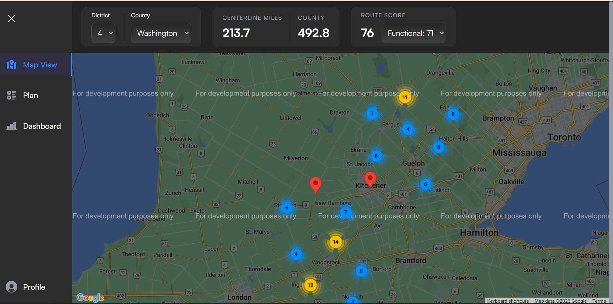
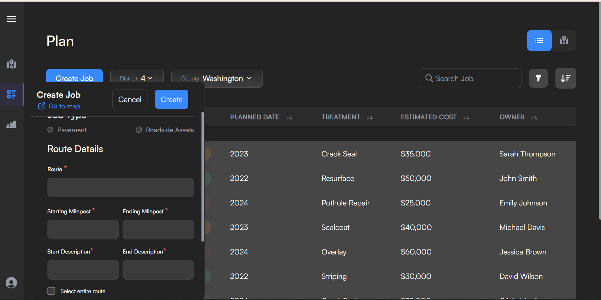

# Infrahub Map UI <a name="title"></a>

This projects aims at creating a very minimal MVP for infrahub.ai

Find it live [here](https://favourz-infrahub-ai-v1.netlify.app/)

## ⛓ Features <a name="features"></a>

- View map data
- View markers and clusters
- View map point real-time image view of particular point on the map with its corresponding lattitude and longititude position
- View route details and create job for that particular route
- View a route condition
- View list of jobs and plan
- Create new job
- Serach for existing jobs
- Filter list of jobs
- Sort jobs table for better UX
- Select a particular job and perform action
- Uses frontend validation to validate data when creating a job for a route

## 📝 Table of Contents

- [Title and Description](#title)
- [Getting Started](#getting-started)
- [Installation](#installation)
- [Screenshots](#screenshots)
- [Features](#features)
- [Built with](#built-with)
- [License](#license)
- [Contributing](#contributing)
- [About Me](#about-me)

## 🏁 Getting Started <a name="getting-started"></a>

These instructions will get you a copy of the project up and running on your local machine for development and testing purposes.

### Prerequisites

You will need node version `16.16.0` and npm version `8.11.0` or higher to launch the project.

Refer to [NodeJs website](https://nodejs.org/en/download) for more instructions.

### Installing <a name="installation"></a>

Step by step process to get the project running on your local machine after the [prerequistes](#prerequistes) have been completed.

Open your command terminal.

Clone the project

```bash
  git clone https://github.com/Favourz1/infrahub-map-ai.git
```

Go to the project root directory

```bash
  cd infrahub-map
```

Creating enviroment variables

- Create an `env.local` file in the root directory that has your google maps api keys

Installing dependencies

```
npm install
```

Starting local server

```
npm run dev
```

The devlopment files are stored in the `./src/` folder.

## 🖥 Sceenshots <a name="screenshots"></a>

<p align="center">
  <a href="" rel="noopener">
 </a>
  <a href="" rel="noopener">
 </a>
  <a href="" rel="noopener">
 </a>
</p>

---

## ⛏️ Built With <a name="built-with"></a>

- 
- 
- 
- 
- 
- 
- 
- 

## License <a name="license"></a>

[](https://choosealicense.com/licenses/mit/)

<!-- ## Contributing <a name="contributing"></a>

Contributions are always welcome!

See [contributing.md](./CONTRIBUTING.md) for ways to get started.

Please adhere to this project's code of conduct. -->

# Hi, I'm Favour Okoh! 👋 <a name="about-me"></a>

## 🚀 About Me

I'm a product-driven and innovative Software Engineer with excellent collaboration skills.

My portfolio on:

[](https://www.linkedin.com/in/favour-okoh/)

Reach me on:

[](https://twitter.com/_favourz)
